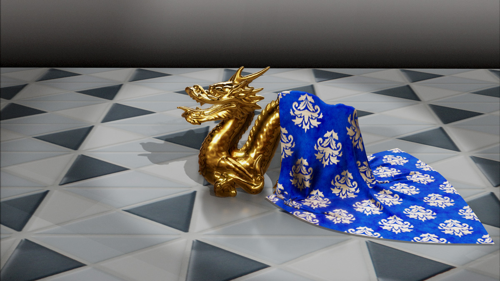

=====================
TouchPy Documentation
=====================

*TouchPy* is a high-performance toolset to work with TouchDesigner components in Python. By leveraging Vulkan, CUDA, and TouchEngine, TouchPy opens new pathways for integration, particularly with libraries such as PyTorch and Nvidia Warp. TouchPy supports GPU-to-GPU (zero-copy) data transfers, streamlining data exchange between standalone Python applications and Touchdesigner.

The first public version of TouchPy was released during the TouchDesigner Event Berlin in May 2024. 

Below an example of a `POPs <https://derivative.ca/community-post/pops-new-operator-family-touchdesigner/69468>`_ cloth simulation on Nvidia Warp implemented using TouchPy:

Quickstart
==========

TouchPy supports Python 3.9 onwards and runs on Windows. To work with TOPs a Nvidia card is required.
TouchPy requires TouchDesigner or TouchPlayer to be installed with a paid license (Educational, Commercial, or Pro).

The easiest way to install TouchPy is from `PyPI <https://pypi.org/project/touchpy>`_:

.. code-block:: sh

    $ pip install touchpy

Basic Example
==============

A basic example which loads and starts a .tox file is given below:

.. code-block:: python

    import touchpy as tp

    class MyBasicComp (tp.Comp):
        """Create a class that inherits from touchpy.Comp
        """
        def __init__(self):
            # call the parent class constructor to initialize the component
            super().__init__()

            # set the on_frame_callback to the on_frame method
            self.set_on_frame_callback(self.on_frame)

        
        def on_frame(self):
            """This method will be called on every frame.
            
            Here we also start the next frame.
            """
            self.start_next_frame()

    # create an instance of your MyBasicComp class
    comp = MyBasicComp()

    # load a tox file into the component
    comp.load('example.tox') 

    # start the component, this will block until self.stop() is called
    comp.start()

    # unload the component to cleanly free up resources
    comp.unload()

Full Table Of Contents
-----------------------

.. toctree::
   :maxdepth: 1

   self
   install
   overview
   license

.. toctree::
    :maxdepth: 2
    :caption: Core Reference
   
    reference/touchpy/index
    types

.. toctree::
    :maxdepth: 2
    :caption: Examples
   
    examples/basic
